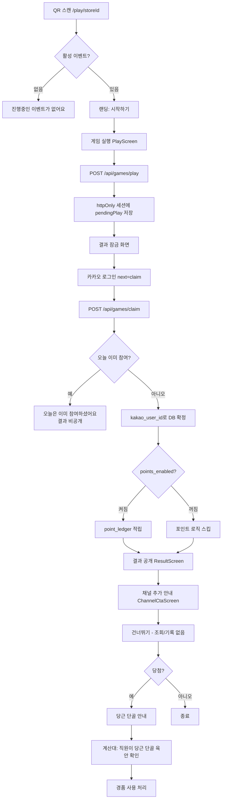

# 손님 여정 프로세스 v2

**적용일**: 2026-08-14  
**핵심 변경**: `로그인 먼저 → 게임` 순서를 `게임 먼저 → 결과 잠금 → 로그인으로 해제`로 뒤집는다.

경쟁사 특허(10-2860945) 회피: **채널/로그인 여부가 게임 실행 조건이 되는 구조 자체를 없앤다.**  
게임은 로그인 없이 누구나 즉시 실행할 수 있다.

---

## 임시 세션 구현 방식 (채택)

**서버 `iron-session` (`dang_customer_session` httpOnly 쿠키)** 에 추첨 결과를 보관한다.

| 후보 | 채택 여부 | 이유 |
|---|---|---|
| 서버 세션 (httpOnly 쿠키) | **채택** | 당첨액이 브라우저에 노출되지 않아 조작이 어렵다. 로그인 전에도 같은 쿠키로 이어진다. |
| 클라이언트 임시 저장 후 로그인 시 제출 | 미채택 | 손님이 당첨액을 바꾸어 제출할 수 있다. |

세션 필드 (`lib/auth/session.ts`):

- `pendingPlay` — 로그인 전 서버 추첨 결과. **화면/API 응답에 금액을 내리지 않는다.**
- `revealedPlay` — 로그인 + 하루 1회 통과 후 공개용 결과.
- `user` — 카카오 로그인 성공 시에만 채워진다. 게임 실행 조건이 아니다.

재고(`prize_tiers.remaining_quantity`)는 **claim(로그인 확정) 시점에만 차감**한다. 로그인하지 않은 추첨은 재고를 깎지 않는다.

---

## 8단계와 실제 코드

### 1) QR 스캔 → 로그인 없이 즉시 게임 화면

| 항목 | 값 |
|---|---|
| 라우트 | `/play/[storeId]` |
| 페이지 | `app/(customer)/play/[storeId]/page.tsx` |
| 흐름 | `PlayFlow` (`landing` → `playing`) |

활성 이벤트만 조회한다. 로그인·하루 1회 체크는 하지 않는다.  
랜딩 카피: "로그인 없이 바로 도전해 보세요!"

임시 세션은 첫 `POST /api/games/play` 때 `getCustomerSession()`이 쿠키를 발급한다. 손님 식별자(`kakao_user_id`)는 없다.

---

### 2) 게임 실행 (조건 없음)

| 항목 | 값 |
|---|---|
| 컴포넌트 | `GameContainer` → `PlayScreen` |
| 게임 코어 | 기존 드래그 크레인 그대로 재사용 |
| API | `POST /api/games/play` body: `{ event_id }` |

`PlayFlow`는 `deferReveal` + `onLocked`를 넘긴다.  
막을 수 있는 조건은 **활성 이벤트 존재**뿐이다 (`.cursor/rules/patent-safety.mdc`).

---

### 3) 결과는 서버에만 저장, 화면에는 잠금

| 항목 | 값 |
|---|---|
| 추첨 | `drawPrizeTier` / `applyStockSafetyNet` (`lib/game-engine/prizeDraw.ts`) |
| 저장 | `session.pendingPlay` (label, amount, tierId, storeId, eventId, drawnAt) |
| 응답 | `{ locked: true }` — **amount / label 없음** |
| 화면 | `ResultLockedScreen` — "결과를 확인하려면 로그인하세요" |

`GET /api/games/pending`도 `hasPending: true`만 알리고 당첨액은 내려주지 않는다.

---

### 4) 카카오 로그인 (카카오싱크)

| 항목 | 값 |
|---|---|
| 시작 | `GET /api/auth/kakao?storeId=...&next=claim` |
| 콜백 | `GET /api/auth/kakao/callback` |
| scope | `profile_nickname`, `phone_number` (로그인+전화번호 동의) |

콜백에서 `session.user`만 채우고 `pendingPlay`는 유지한다.  
`next=claim`이면 `/play/[storeId]?claim=1`로 돌아온다. `PlayFlow`가 이때만 claim을 이어간다.  
QR·공유 링크(`/play/[storeId]`)는 이전 잠금 세션이 있어도 **항상 첫 화면(랜딩)** 이다.

개발 환경(카카오 키 없음)은 `POST /api/dev/mock-customer-session`으로 동일하게 손님 세션만 심는다. 프로덕션에서는 404.

---

### 5) 로그인 성공 시점 — 확정 저장 + 하루 1회

| 항목 | 값 |
|---|---|
| API | `POST /api/games/claim` |
| 하루 1회 | `hasPlayedToday()` → `daily_participation_log` (이 시점에만 체크) |
| 확정 | `persistPendingPlay()` (`lib/game/persistPlayResult.ts`) |

이미 참여한 계정이면:

- `pendingPlay` 삭제
- `{ alreadyParticipated: true }`
- `AlreadyParticipatedScreen` — **결과는 공개하지 않음**

통과하면 `kakao_user_id` 앞으로 기록한다.

| 테이블 | 내용 |
|---|---|
| `daily_participation_log` | 오늘 참여 확정 (unique 충돌 시 이미 참여) |
| `coupons` | 당첨 시 `pending_verify` 발급 |
| `point_ledger` / `customer_loyalty` | 매장 포인트 스위치가 켜져 있을 때만 |
| `activity_log` | `game_start` / `game_complete` / `point_earned` |

설계 초안의 `game_events` 테이블은 사용하지 않는다. 참여 원시는 `daily_participation_log` + `activity_log`다.

---

### 6) 결과 공개 + 포인트 + 쿠폰

| 항목 | 값 |
|---|---|
| 화면 | `ResultScreen` (`step === 'result'`) |
| 포인트 스위치 | `store_settings.points_enabled` (Migration 029) |
| 관리 화면 | 관리자 → 포인트 정책 설정 (`LoyaltySettingsClient`) |

스위치가 꺼진 매장은 `persistPendingPlay`에서 포인트 RPC/ledger insert를 **호출하지 않는다.** 쿠폰은 그대로 발급된다.

---

### 7) 카카오 채널 추가 안내 — 순수 선택

| 항목 | 값 |
|---|---|
| 화면 | `ChannelCtaScreen` |
| 동작 | `[건너뛰기]`만 있음. API 호출 없음 |

채널 가입 여부를 조회하거나 기록하지 않는다.  
건너뛰어도 쿠폰·포인트·결과는 이미 확정된 상태라 영향이 없다.  
당첨이면 이어서 `VerificationCtaScreen`(당근 단골 안내), 꽝이면 랜딩으로 돌아간다.

---

### 8) 종료 — 계산대에서 당근 단골 육안 확인

기존 정책 그대로. 카카오 채널은 경품 지급 조건에 넣지 않는다.

- 손님: `/checkout/[storeId]`
- 직원: `/staff` → `[확인함]` → `[할인 적용 완료]`

---

## 순서도

---

## 관련 파일 목록

| 역할 | 경로 |
|---|---|
| 손님 상태머신 | `app/(customer)/play/[storeId]/PlayFlow.tsx` |
| 게스트 추첨 | `app/api/games/play/route.ts` |
| 로그인 후 확정 | `app/api/games/claim/route.ts` |
| 잠금 여부 조회 | `app/api/games/pending/route.ts` |
| 확정 저장 | `lib/game/persistPlayResult.ts` |
| 세션 타입 | `lib/auth/session.ts` |
| 결과 잠금 UI | `components/play/ResultLockedScreen.tsx` |
| 채널 CTA | `components/play/ChannelCtaScreen.tsx` |
| 포인트 스위치 | `store_settings.points_enabled` / 관리자 포인트 정책 |
| 특허 원칙 | `.cursor/rules/patent-safety.mdc` |
